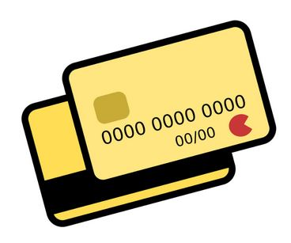
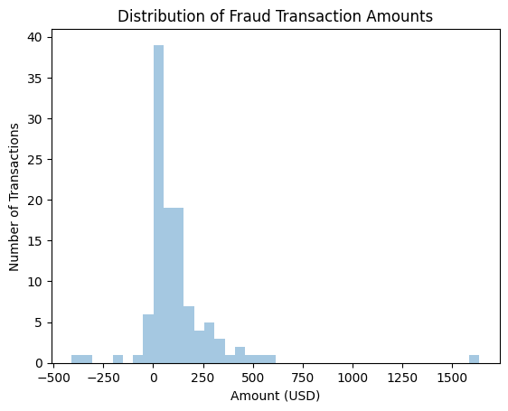
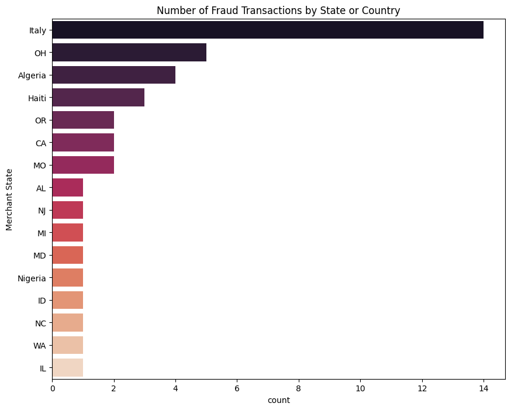
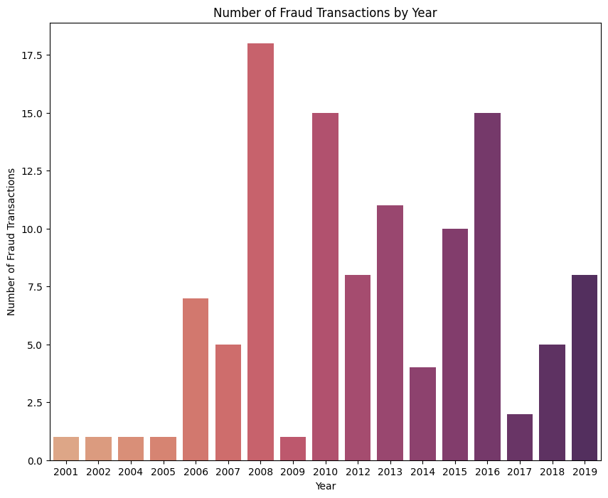
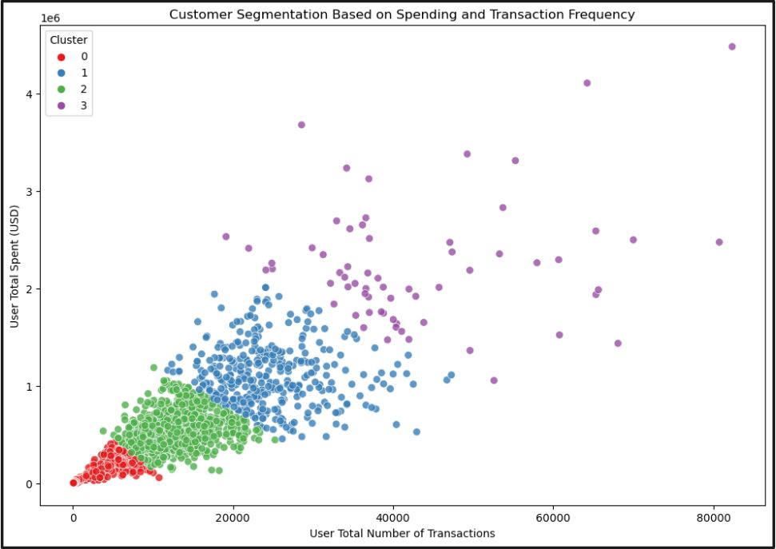

## Unsupervised Learning: Credit Card Clustering
* Question: What is a good method to cluster credit card users?
* Results: K-means clustered customers based on total spending and number of transactions with a silhouette score of 0.514.

### Summary :speaker:
* Background
* Exploratory Data Analysis
* Models
* Applications
* Next Steps

  

### Background 
* Credit card companies are profitable and a large part of culture in the United States
* Credit card companies made $105 billion in interest in 20221
* 82% of U.S. Adults had a credit card in 2022.2
* Companies may want to segment its users to maximize engagement and profit
* Question: What is a good method to cluster credit card users?

### The Data :bar_chart:
* The data set has 2000 fictioning customers resident in the United States but occasionally travel the world.
* Includes more than 24 million transactions generated by IBM
https://www.kaggle.com/datasets/ealtman2019/credit-card-transactions/data

### Exploratory Data Analysis :paperclip: 
- [x] 15 features
- [x] 66 duplicate rows removed
- [x] Multiple missing values in Merchant State, ZIP, and Errors.
- [x] Converted Year, Month, Day into dataframe Date format
- [x] The credit card user total amount spent and the total number of transactions in the dataset were examined.

  

  

  

### Data Modeling :bar_chart:
* K-Means and DBSCAN clustering methods were used to cluster the customers.
* Hyperparameters in both models were tuned
* K-Means had a silhouette score of 0.514
* DBSCAN had a silhouette score of 0.834
* Even though DBSCAN had a higher silhouette score, the clustering from DBSCAN is not realistic or beneficial.
* K-Means clustered the customers more realistically. The outliers were clustered into one group which lowered the silhouette score.

  

### Applications:
* This model can be utilized in credit card companies that want to segment their customers to increase business efficiency.
* Give bonuses and incentives to different segments. For example, the customers that spend more money and more frequently can accumulate more points.
* Forecast customer spending per segment to prepare for future budgeting and promotions.
* Hypothesize which segment new customers would fit in.
 
### Next steps:
* Cluster users based on other features such as spent amount per year or transactions per year
* Combine this model with other models such as predicting credit card fraud.

 

